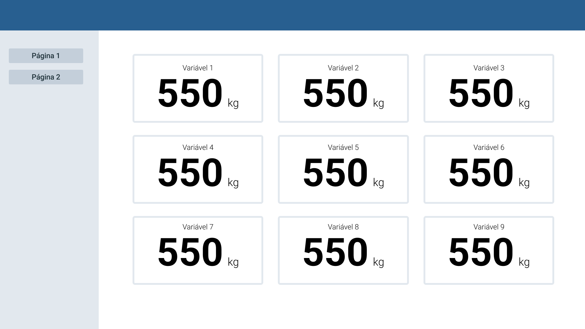

Usando React, react router e axios, crie uma pagina web, seguindo o layout abaixo.

Ela deve possuir duas páginas e navegação entre elas através do menu lateral
Os dados mostrados em cada página devem ser os dados do arquivo data.json, que está nessa mesma pasta. Ele deve ser consultado através da API do github e não importado localmente no projeto.

Todos os outros requisitos são livres ao desenvolvedor.

Vão ser observados:

- Funcionalidade
- Semelhança com o layout solicitado
- Organização do código e projeto
- Organização de commits e gerenciamento
- Familiaridade com a linguagem
